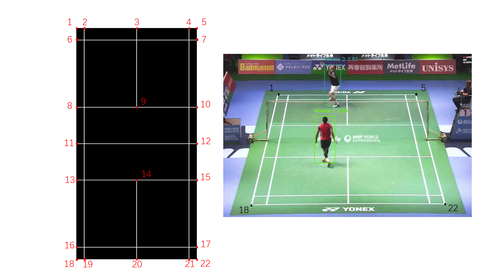

# Documentation
This is a documentation describing the solution of ths [task](../README.md) provided by Swiss Timing.

## Brief of Solution
A brief solution for the given task is as follow:
* Video loading
* Image processing
    * Athlete detection
    * Athlete tracking
    * Bird's eye view map
* Output
    * Real-time display
    * Video playback
    * Extracted information in JSON format

## Dataset
The test dataset used in this project is a short clip (10 seconds) cropped from in a [Youtube video](https://www.youtube.com/watch?v=TSfvUlU8P28), showing two top badminton players, Lin Dan from China and Viktor Axelsen from Denmark, in 2015 Yonex Open Japan Champion. The RGB camera is static. There are 300 frames in this 10 seconds video, with resolution of 1920*1080. 

## Methodology
### Athlete detection
Athlete detection, or object detection is the core component of this system. In this project, a pretrained YOLOv5 model is utlized to tackle this object detection problem. By using the YOLOv5 ONNX model converted from a PyTorch model, we can construct a YOLOv5 network with pretrained weights easily with the help of OpenCV DNN module [cv::dnn](https://docs.opencv.org/4.x/d2/d58/tutorial_table_of_content_dnn.html).

### Athltete tracking
In order to track multiple players, assigning different label id for different players, we record the centroid of each bounding box and compute the distance between two bounding box centroid. If the distance is smaller than a threshold, these two bounding boxes are labelled the same player id. If the distance is larger than the threshold, then a new player is discovered and the bounding box is assigned a new player id.

### Bird's eye view (BEV) map
With the bounding box information, the coordinate of athlete's feet can be approximately obtained. By using the perspective matrix from camera image to BEV plane, the coordinate of the athlete under the bird's eye view can be computed. In order to compute the perspective matrix using [cv::getPerspectiveTransform](https://docs.opencv.org/2.4/modules/imgproc/doc/geometric_transformations.html#getperspectivetransform), the coordinates of four badminton corners in both coordinate system (camera plane and BEV plane) are required. For example, for the badminton court used in the example, we need to define a BEV map as the figure below and obtain the corners coordinate (points 1, 5, 18, 22).
<!--  -->

    

### Extracted information in JSON format 
In this project, the extracted information is stored in JSON format using a popular JSON library [nlohmann/json](https://github.com/nlohmann/json). The content of the extracted information in JSON includes: 
* data.frame_id: frame id
* data.human_id: detected human id inside the bounding box
* data.left_top_x: x coordinate of the left top corner of the bounding box
* data.left_top_y: y coordinate of the left top corner of the bounding box
* data.width: width of the bounding box
* data.height: height of the bounding box

## Limitations and Future Improvements
### Real-time processing
Even though a real-time display is avaiable in this projcet, it is not a real real-time (25Hz) due to the limitation of hardware. Future improvements could be using a GPU for model reference or using several thread to process the frames simultaneously.

### Skipped frame   
As you can see from the results, the detector fails to detect Viktor (the background player) in some frames. Possible reasons include low detection threshold. In order to tackle this issue, on the one hand, we could increase the detection threshold and on the other hand, we could leverage a Kalman filter to compensate the missing bounding box based on the previous bounding box.

## Reference
* https://learnopencv.com/object-detection-using-yolov5-and-opencv-dnn-in-c-and-python/
* https://json.nlohmann.me/
* https://docs.opencv.org/2.4/modules/imgproc/doc/geometric_transformations.html#getperspectivetransform
* https://opencv-tutorial.readthedocs.io/en/latest/yolo/yolo.html